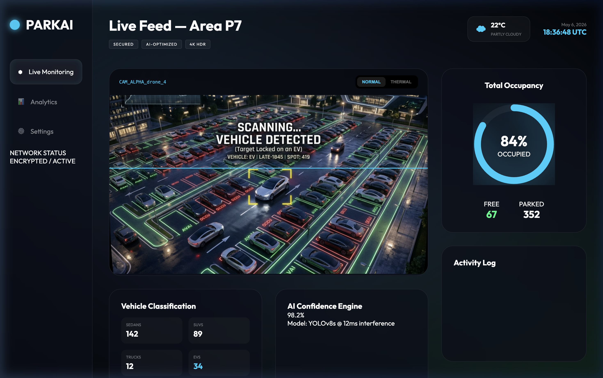
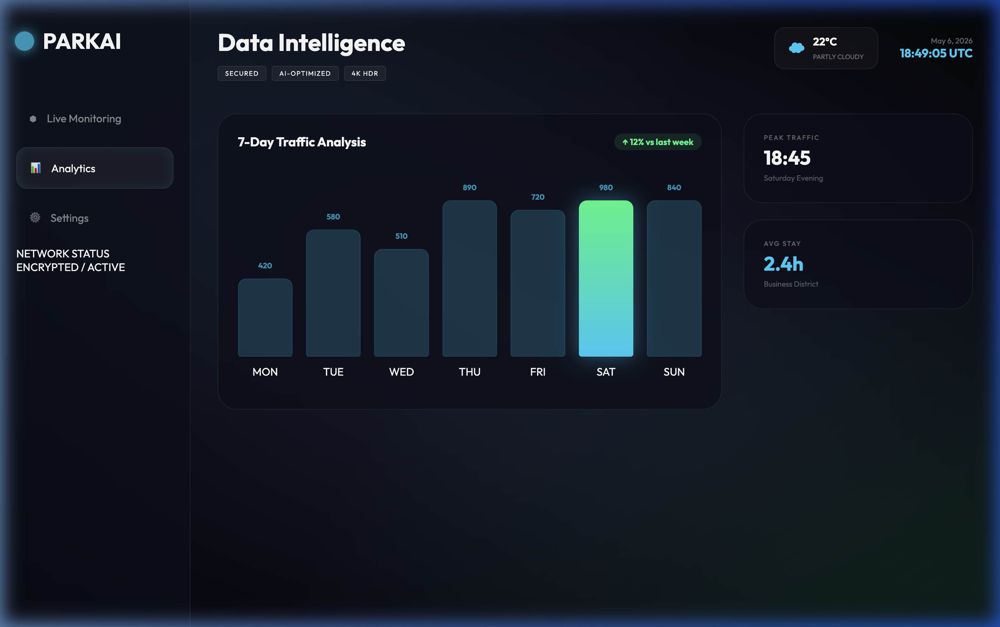
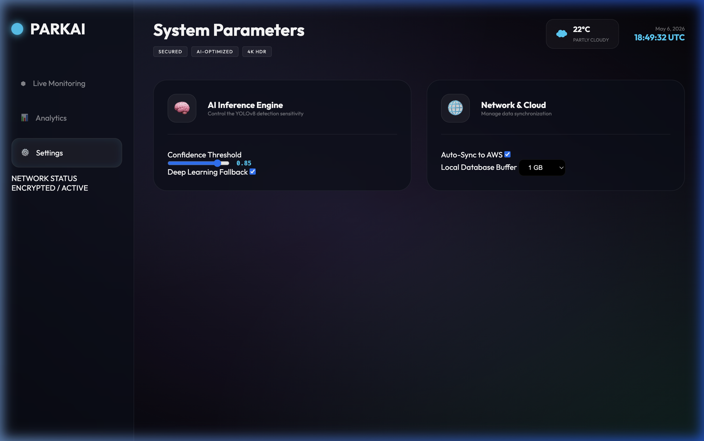
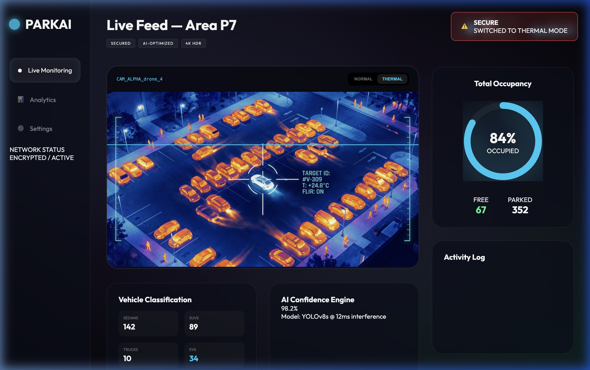

# 🌌 ParkAI — Next-Gen AI Surveillance Dashboard



**ParkAI** is a premium, "Cyber-Command" grade AI Parking Analytics platform. It transforms standard overhead/drone footage into a high-fidelity monitoring interface featuring real-time vehicle classification, thermal heatmap toggling, and deep-learning-driven occupancy tracking.

---

## ✨ Key Features

### 🖥️ High-End Monitoring
- **Glassmorphism 2.0 UI**: A stunning, semi-transparent interface with animated mesh backgrounds and glowing HUD overlays.
- **Dual-Mode Feed**: Seamlessly toggle between **Spectrum (Normal)** and **Thermal (Heatmap)** views for enhanced night/low-visibility tracking.
- **HUD Overlays**: Real-time scan-lines and target tracking boxes for high-tech surveillance feel.

### 🧠 Intelligent Analytics
- **Vehicle Classification**: Real-time identification of **Sedans, SUVs, Trucks, and EVs**.
- **7-Day Intelligence**: Interactive bar charts tracking weekly traffic trends and peak occupancy times.
- **AI Confidence Engine**: Live monitoring of YOLOv8 model performance and interference latency (ms).

### 🚨 Smart Alerts & Security
- **Dynamic Security Toasts**: Automated notifications for unauthorized entries, illegal parking, and abandoned packages.
- **Activity Log**: Persistent tracking of vehicle entries/exits per sector.

### ⚙️ System Control
- **AI Threshold Tuning**: Adjustable confidence levels for the inference engine.
- **Cloud Sync**: Optional synchronization to AWS/Cloud infrastructure.

---

## 📸 Dashboard Preview

| **Analytics Intelligence** | **System Parameters** |
|:---:|:---:|
|  |  |

| **Thermal Surveillance Mode** |
|:---:|
|  |

---

## 🛠️ Tech Stack

- **Computer Vision**: `OpenCV`, `YOLOv8 (Ultralytics)`
- **Frontend**: `HTML5`, `Vanilla CSS (Modern Grid/Flex)`, `JavaScript (ES6+)`
- **Design System**: Glassmorphism, CSS Keyframe Animations, Dynamic Mesh Gradients.
- **Backend**: `Python 3.11+`

---

## 🚀 Getting Started

### 1️⃣ Clone & Setup
```bash
git clone https://github.com/alwaysprince05/ai-parking-analytics.git
cd ai-parking-analytics
```

### 2️⃣ Install Dependencies
```bash
pip install opencv-python ultralytics numpy
```

### 3️⃣ Launch the Dashboard
```bash
# Start the monitoring engine
python main.py input.mp4

# Open the dashboard
cd web_dashboard
# Open index.html in your browser or run a local server
python3 -m http.server 8080
```

---

## 👤 Developer
**Prince Maurya**  
[GitHub Profile](https://github.com/alwaysprince05)

---

## ⚖️ License
Distributed under the MIT License. See `LICENSE` for more information.
